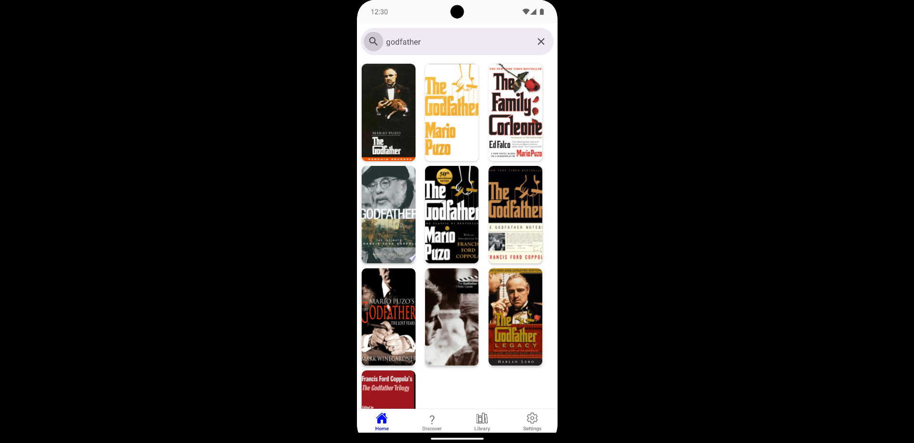
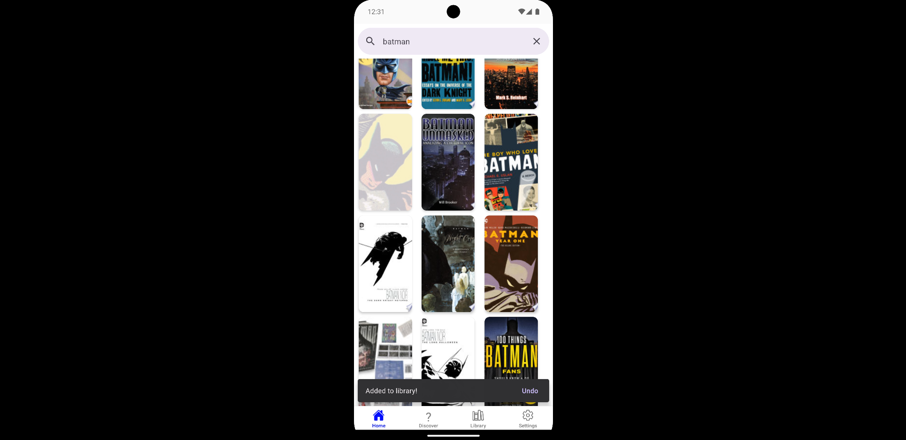
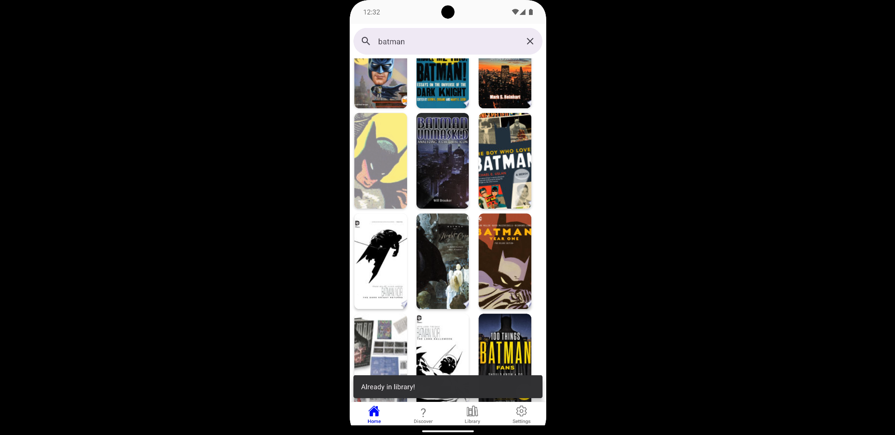
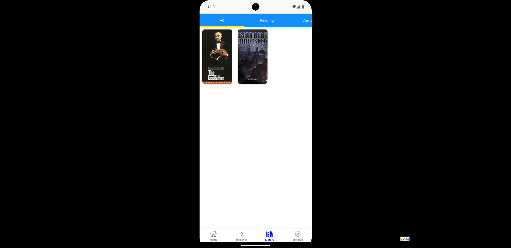
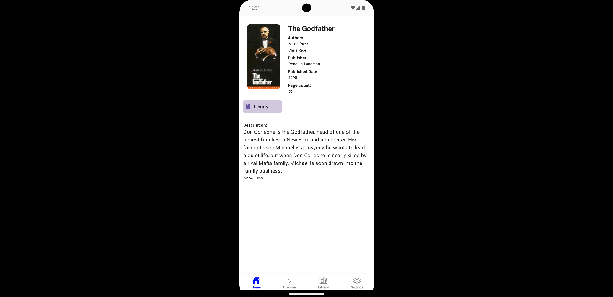

# 📚 bookTrakt  

A **React Native** mobile app for book lovers to track their reading progress, discover new books, and manage their personal library. Built with **React Native, Firebase, and Google Books API**, this app offers a seamless reading experience.  

## 🚀 Features  
✅ **Search & Discover** – Find books using Google Books API.  
✅ **Track Reading Progress** – Mark books as "To Read," "Reading," or "Finished."  
✅ **Favorites & Wishlist** – Save books for later.  
✅ **Authentication** – Secure login with Firebase authentication.  
✅ **Smooth UI & Performance** – Optimized for fast, responsive navigation.  

## 🛠️ Tech Stack  
- **Frontend**: React Native, Expo  
- **Backend**: Firebase (Auth, Firestore)  
- **APIs**: Google Books API  
- **State Management**: React Context API  

## 📸 Screenshots  

### Main Screen  
  

### On Hold Tile  
  

### On Hold Tile (Already favourited)  
  

### Reading List Screen  
  

### Book Details Screen  
  


## 🎥 Demo Video  
Demo is in screenshots/BookTrakt.mp4 

## 📦 Installation  
1. Clone the repository:  
   ```bash  
   git clone https://github.com/zainali28/bookTrakt.git  
   cd bookTrakt  
   ```  
2. Install dependencies:  
   ```bash  
   npm install  
   ```  
3. Start the app:  
   ```bash  
   npm run start
   ```  

## 🔥 Future Improvements  
- Add **book recommendations based on reading history**  
- Implement **user reviews & ratings**  
- Dark mode support  

## 🤝 Contributing  
Contributions are welcome! Feel free to fork and submit a PR.  

## 📜 License  
This project is licensed under the **MIT License**.  
